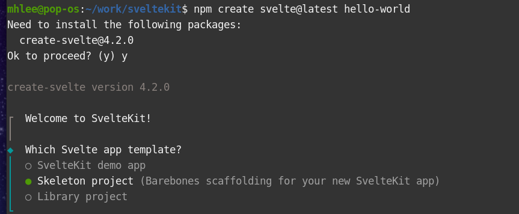
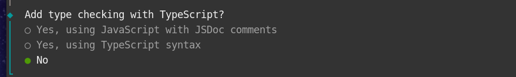
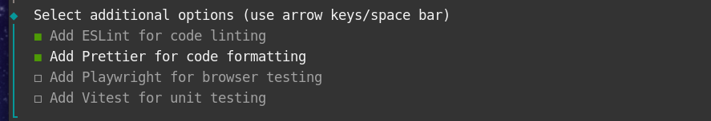
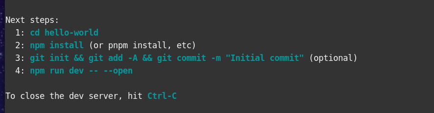
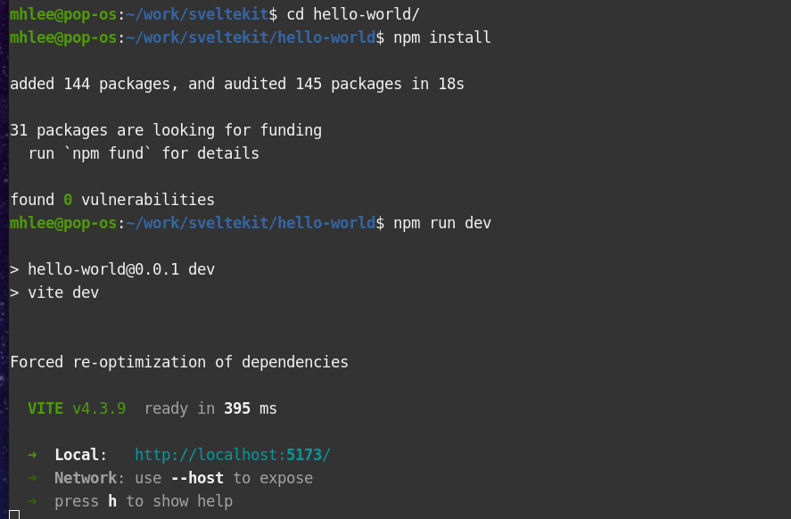
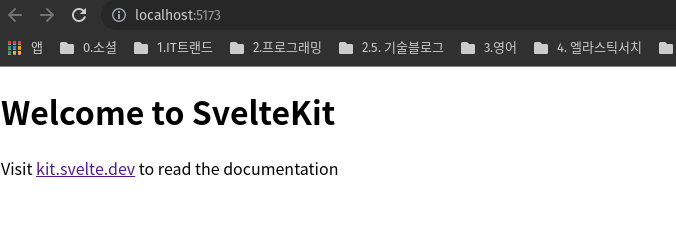

# SVELTEKIT 프로젝트 시작하기

## 1. 프로젝트 생성

1. npm create svelte@latest hello-world

2. svelte 최신이 설치되어 있지 않다면 설치 한다.

3. 아래 그림과 같이 스켈레톤 프로젝트를 선택한다.

4. svelte에 집중하기 위해 ts 옵션은 선택하지 않는다.

5. lint 설정은 첫번째, 두번째 옵션을 옵션을 선택한다.

## 2. 프로젝트 빌드 & run

1. 위 내용을 진행하면 아래와 같은 내용이 출력된다.

2. 나열된 명령어를 순서대로 실행한다. (3번은 옵션)

3. 이상이 없다면 아래와 같은 내용이 출력될것이다.

## 3. 사이트 접속

1. 콘솔에 출력된 주소로 접속하면 아래와 같은 사이트가 출력된다.

